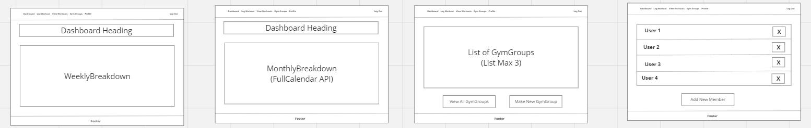
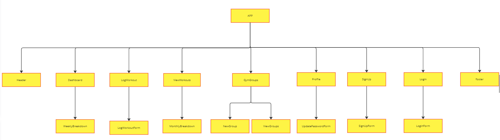
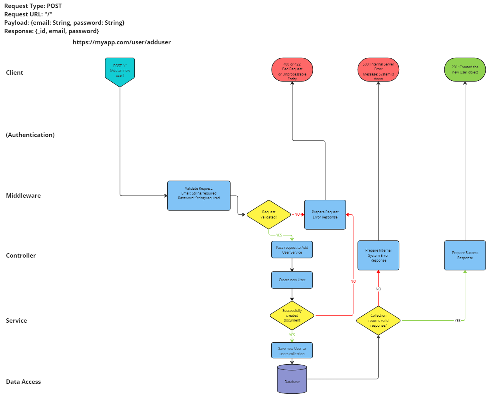
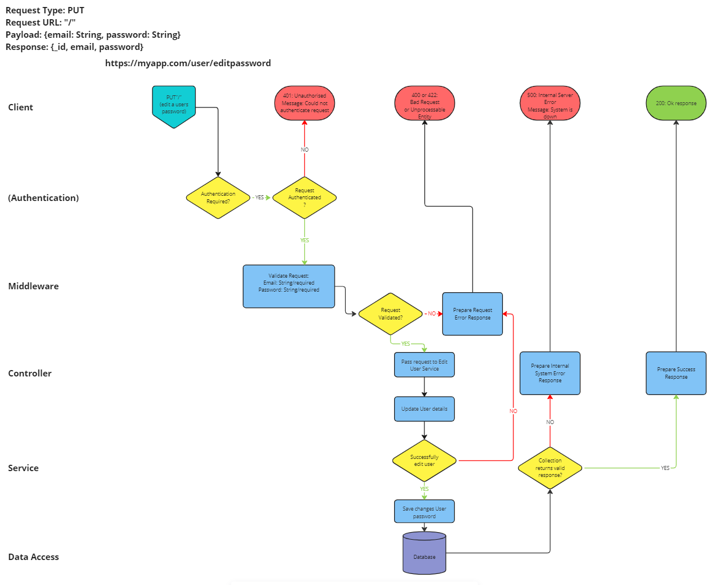

# The GymGoers App Proposal

## MVP:

An app that people i.e. me and my friends can use to track our workouts – Tracking your
progression is a very important part of the gym that many people miss out on. Being an
online application means that all the data is stored securely and can be accessed at
any time.

## Title:

The GymGoers

## Description:

In essence, The Gymgoers is an application used to track and visualise the progression of gym goers. However, there is also a social aspect to this application where, as part of the application, users can create workout group chats where group members can share their progression.

## Context:
The benefits of the gym rely heavily on routine and discipline, missing just one day can knock your progress. Tracking your workouts is an essential part of this as it is a chance to see your progress.

For many people, the gym is a social activity and a chance to 
be competitive. The GymGoers leans on the social impact and importance of accountability to track and compete with a group of users.

The GymGoers application tackles this issue by allowing users to log their workouts and track their progression whilst allowing users to share their details in groups that they create. It is the groups where progression can be shared that will incentivise users to keep up with the other members of the group.

## Features:

To use the application, you must either login or create an account.

The user must register an account by using an email and password, they can also edit the
password to update it once logged in.

They have the following features once logged in.

```
NavBar:
```
- Dashboard – Contains the last 7 days of workout logs
- View workout entries – Contains the last months workout logs with the
    option to delete logs
- Log a new workout entry
- Make a group chat – where you can invite other users to
- View group chats

```
Dashboard:
```
- Shows the workouts in the last 7 days.

Gym Groups:
    - Users are shown a list of the groups they have access to.
    - Users can create group chats and have the feature to add and remove
       friends from their groups.
  

## User interface:


On the applications start-up the user is shown a log in page with a header that has an
option for the register page.

On log in, the dashboard is shown which contains the workout logs in the last 7 days,
there is also a navigation menu that has the following options; dashboard, log workout,
view workouts, gym groups, and profile.

On the log workout page, the user is shown a form that is used to log workouts, here the
user must enter the type of exercise, the weight, number of repetitions and sets and any
additional notes they would like to add about the exercise. There will be a button to
submit the workout log to the database.

When viewing the workout logs, the user is sent to a new page that contains the
workout of the last month, the user will be able to click on a workout to see all the
details of the workout.

Clicking Gym Groups will take the user to a new page that will show at maximum 3 of
the groups they are in with two options, to create a new group or to view all their groups.

When a specific Gym group is accessed by the group admin/admins, they will have the
ability to delete members from the group and also, they have access to view individual
members workout logs.



## Architecture:

The architecture of this application has been split into three parts.

The first part of this application is the client-side application. The user interface will be developed using React and JavaScript for any logic on how the user interacts with the application.

The second part is the database. This application will use the MongoDB Atlas service to store all the user's data. The data stored will include the users' details (email & password), the workout logs and the data relating to the users' GymGroups. 

To complete the architecture, the different parts will need to communicate with each other. To do this Node.js will be used to develop the server-side application. The server-side application will connect the client side with the database and help handle the requests between the two, delivering a seamless experience for the user.


**Component Hierarchy:**



## RESTful Routing:

The application will need a set of routes to handle requests made while using the applications. 

A route is needed to allow users to register an account. A POST request that sends the user's details to create an account is required. To handle users logging in, a GET request is needed to check that the details used to log in, match the records in the database. Finally, a user who has logged in can update their password to handle this a PUT request that edits a user's password will be created.

Once logged in users can make workout logs and view workout logs. A POST request is needed to add workout logs to the database and a GET request to display the workout logs of a specific user.

One of the features of this application is to create GymGroups. To do this a POST request to the database is needed to create an instance of the GymGroup model that contains the members of the GymGroup.




## Technologies Used:

frontend

- React
- JavaScript

Backend

- Node
- Express


Database

- MongoDB – atlas
- Mongoose - To develop the models stored in the database

For testing

- Mocha
- Chai

APIs

Potentially if time allows, I will make use of the FullCalendar API to display the workout logs in a
calendar format. The reason I have chosen the FullCalendar APi is because I am using
JavaScript and the API is an open-source JavaScript library. By using this API integrating
the calendar functionality will be easy as it is also highly customisable.

## Deployment:

This application will be making use of cloud services for its deployment. The application must be available to anyone connected to the internet. Meaning that the application will need to be deployed in a way that allows access at all times.

MongoDB Atlas - The database will be hosted on the MongoDB Atlas cloud service so that the database is available at all times. 

Netlify – Netlify will be used to host the server-side application. Netlify supports continuous development from Git repositories. This application will be developed using a Git repository, this service will integrate seamlessly with the application, improving the quality of code.

Render – This application will be created using nodeJS, Render is a tool that makes deploying applications created using NodeJS.

## Potentially Features For The Future

### Business Use Case

There is an interesting business use case for this application. The business use case includes the following:

Business User: this is for users that need to use the application as a tool to manage 
multiple clients and to provide better feedback to them. 

With this account the business user will not have the features to create workout entries 
it will be only used to manage personal users. 

```
NavBar:
``` 
- Create a group chat – invite members 
- View group chat – add members, view members workouts, and delete members 
from group 

```
GymGroups
```

- Create workout groups – personal users can be invited to workout groups, here their 
workouts can be seen by the admin (The business user) and they have the feature to 
remove personal users from the group

This is an area of the application that can be worked on in future developments. At the moment this application is a B2C application but in the future the application has room to allow grow into a B2B application by implementing the business user.

### Calendar API 

Another feature that could be implemented given more time, is the FullCalendar API. The FullCalendar API can display the workout logs in a calendar format. The reason for choosing the FullCalendar API is how well it integrates with JavaScript as the API is an open-source JavaScript library. Using this API will improve the user experience and integrating it will be easy as it is also highly customisable. However, it requires more time than is available to understand and implement it correctly which means that it will need to be saved for any future developments. 


